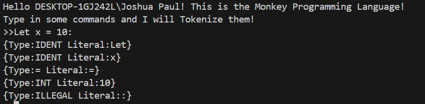

# Computer Engineer
  **Technical Skills: Verilog, C, Python, Embedded Systems**
# Education
B.S. Computer Engineering    
California State Polytechnic University of Pomona   

# Work Experience
**Boiling Point(June 2018 - present)**  
_Supervisor_  
▪ Responsible for resolving problems internally and externally, such as with customers or employees, resulting in 
me being a proactive problem solver with strong communication and interpersonal skills. 

**SpaceX (Contract 2023)**  
_Production Assistant_  
▪ Proficient in handling logistics, scheduling, and managing inventory to keep things organized and on schedule 
for the project at hand. Project was supposed to be for one month but was finished in three weeks.

_<---Detailed Portfolios can be found with the Links to the left_
## Notable Overall Engineering Project##
**Flying Unmanned Ground Drone “Kepler-1708b” (NASA Minds 2023 Competition)**

**Notable Embedded Software Project**
**Adjustable Time Digital Clock**

<video src="https://github.com/user-attachments/assets/ae05a406-ecce-4c72-9af1-dec533bb6032" controls="controls" style="max-width: 730px;"></video>

**Notable Software Project**
**Blackjack game (Python)**

<video src="https://github.com/user-attachments/assets/4c0a1bf7-8261-44b7-9ba1-a0a15066870c" controls="controls" style="max-width: 730px;"></video>

**Current Project**
*Creating an Interperter in Go*   
Roadmap: Lexer -> Parser -> AST (Abstract Synytax Tree) -> Evaluator   
Finished: Lexer

Current Step: Parser

